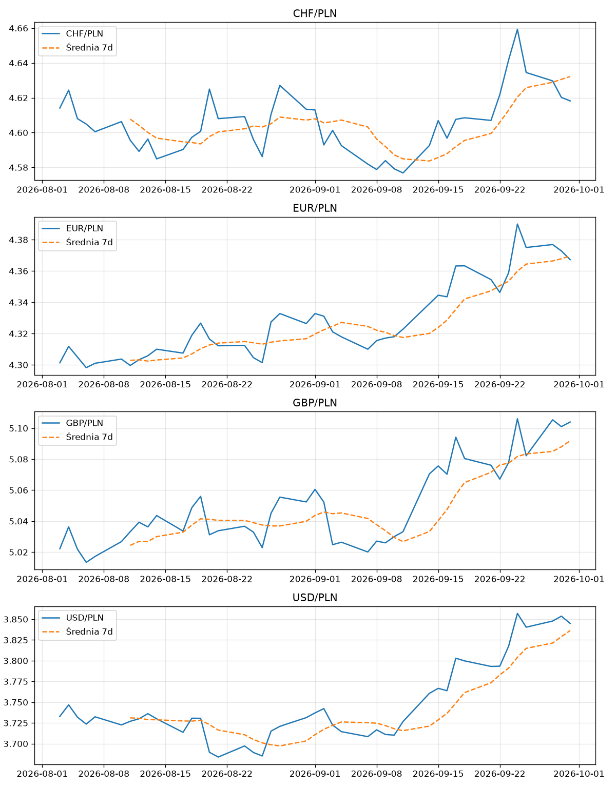

# NBP FX Rates ETL Pipeline

A small, tested ETL pipeline that pulls daily exchange rates from the public [NBP Web API](https://api.nbp.pl/en.html), loads them incrementally into SQLite and runs SQL analytics (CTEs + window functions). Results can be exported to Excel, CSV or a chart.



## What it does

```
NBP REST API  ->  Extract  ->  Transform  ->  Load (SQLite)  ->  SQL analytics  ->  Excel / CSV / PNG
```

- **Extract** – requests rates per currency and date range (split into chunks to respect API limits), with timeout, retries and exponential backoff.
- **Transform** – validates every record (missing fields, non-positive or non-numeric rates, bad dates) and removes duplicates. Rates are parsed with `Decimal` and stored as integers (rate x 10,000) to avoid floating-point errors.
- **Load** – idempotent upsert (`INSERT ... ON CONFLICT DO UPDATE`) with composite key `(currency, rate_date)`. Re-running the script only fetches days missing since the last loaded date.
- **Analytics** – one SQL query with a CTE and window functions partitioned by currency:
  - previous-day rate and daily change (`LAG`)
  - 7-day moving average, min and max (only for full 7-row windows, otherwise `NULL`)
  - 7-day trend (%)

## Example output

```
Waluta | Data       |     Kurs |   Poprz. |   Zmiana |    Śr.7d |     Min7 |     Max7 |  Trend7d
USD    | 2026-09-30 |   3.8449 |   3.8537 |   -0.23% |   3.8364 |   3.7934 |   3.8570 |   +1.37%
USD    | 2026-09-29 |   3.8537 |   3.8478 |   +0.15% |   3.8290 |   3.7931 |   3.8570 |   +1.42%
```

## Quick start

```bash
git clone https://github.com/Lagranzjan/fx_rates_etl_analytics_pipeline.git
cd fx_rates_etl_analytics_pipeline
python -m venv .venv && .venv\Scripts\activate      # Windows (Linux/macOS: source .venv/bin/activate)
pip install -r requirements.txt

python nbp_pipeline.py                               # USD, EUR, CHF, GBP, last 60 days
python nbp_pipeline.py -c USD EUR -d 120             # chosen currencies and history length
python nbp_pipeline.py --xlsx kursy.xlsx --csv wyniki.csv --plot
```

The core pipeline uses only the Python standard library. `openpyxl` (Excel export) and `matplotlib` (chart) are optional and skipped with a warning if missing.

| Option | Description |
|---|---|
| `-c`, `--currencies` | Currency codes (default: `USD EUR CHF GBP`) |
| `-d`, `--days` | History length on the first run (default: 60) |
| `--db` | SQLite file path (default: `nbp_analytics.db`) |
| `--limit` | Number of latest days per currency in the console report |
| `--xlsx FILE` | Excel workbook: one sheet per currency, filters and a native Excel chart |
| `--csv FILE` | CSV in Polish-Excel-friendly format (`;` separator, decimal comma, UTF-8 BOM) |
| `--plot` | Save `nbp_chart.png` (rate + 7-day moving average) |

## Tests

```bash
python -m pytest -v
```

16 unit tests cover the transform step (validation, de-duplication), idempotent loading, window-function logic (`NULL` until the 7-day window is full, no data leakage between currencies) and date chunking.

## Design decisions

- **Integers instead of floats** for money-like values, to avoid rounding errors.
- **Idempotent, incremental loads** so the pipeline can be scheduled (cron / Windows Task Scheduler) without duplicating or deleting history.
- **Windows partitioned by currency**, so adding a new currency needs no SQL changes.
- **Graceful failures** – a failing currency is logged and skipped, the others still load.

## Possible next steps

Scheduling with cron / Airflow, more metrics (volatility), loading to a cloud warehouse such as BigQuery.

## Data source

Exchange rates (table A, average rates) from the National Bank of Poland public API.
